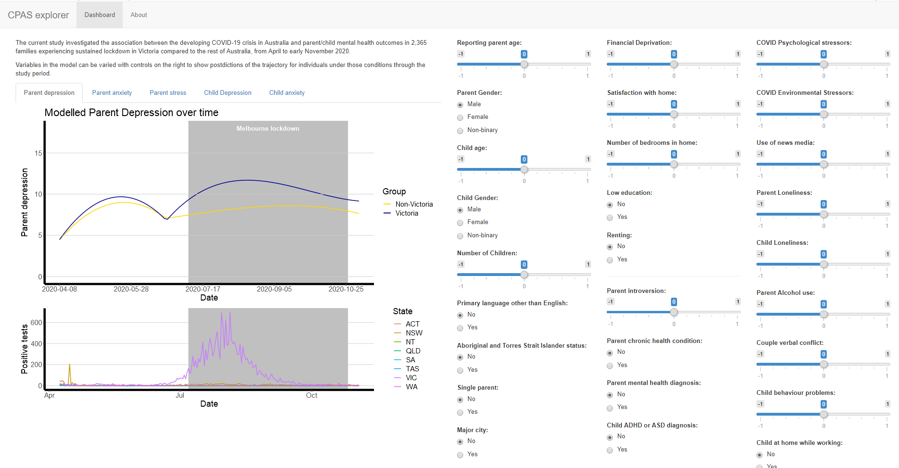

<!-- README.md is generated from README.Rmd. Please edit that file -->

```{r, include = FALSE}
knitr::opts_chunk$set(
  collapse = TRUE,
  comment = "#>"
)
```
# CPAS Trend

<!-- badges: start -->
<!-- badges: end -->

This repository contains a shiny app to present results from the COVID-19 Pandemic Adjustment Survey (CPAS) longitudinal research project. 

## About the Study

The COVID-19 Pandemic Adjustment Survey (CPAS) is a longitudinal research study investigating how Australian families have been affected by the COVID-19 pandemic. Australia experienced early success after a nation-wide lockdown in April 2020. However, the state of Victoria went on to experience an outbreak and one of the longest and strictest lockdowns in the world over July-October 2020, while the rest of Australia had low infection rates and easing restrictions. In the current analysis, we investigated the association between the developing COVID-19 crisis and parent/child mental health outcomes in families experiencing sustained lockdown in Victoria compared to the rest of Australia, from April to early November 2020.

## About the App

The shiny app allows a user to explore the modeled trajectories of Australians during the COVID-19 pandemic from 8th April to 3rd November, 2020 based on a number of predictors. 



## Authors

Elizabeth Westrupp, Christopher Greenwood, Mathew Ling, Gery Karantzas, Jacqui Macdonald, Emma Sciberras, Antonina Mikocka-Walus, Robert Cummins, Delyse Hutchinson, Glenn. A Melvin, Julian Fernando, Samantha Teague, Amanda Wood, John Toumbourou, Tomer S Berkowitz, Jake Linardon, Lisa Olive, Peter Gregory Enticott, Mark Andrew Stokes, Jane McGillivray, Craig Olsson, Matthew Fuller-Tyszkiewicz and George Youssef
